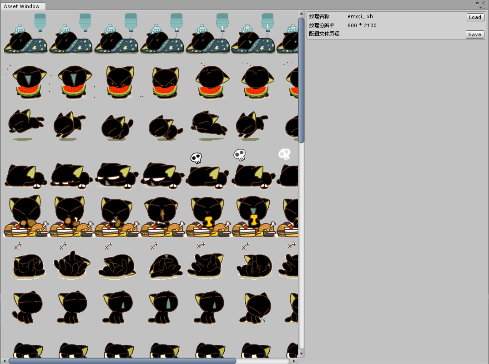
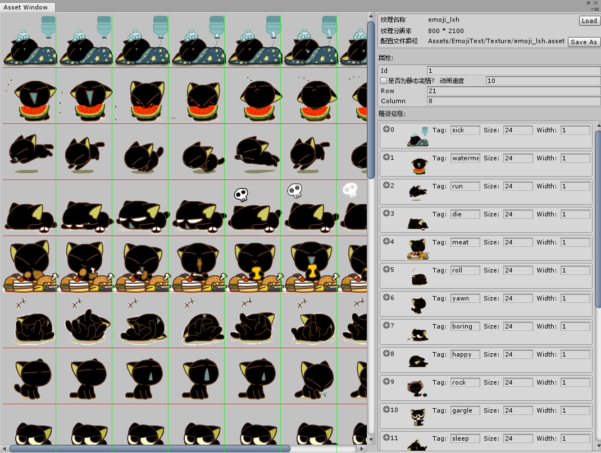
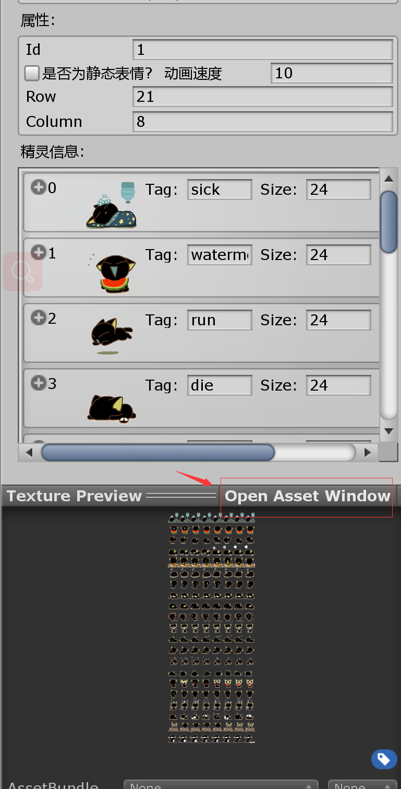
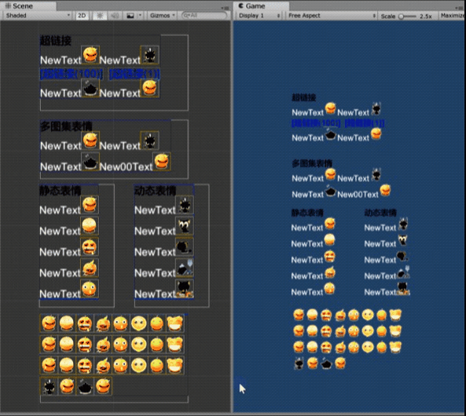
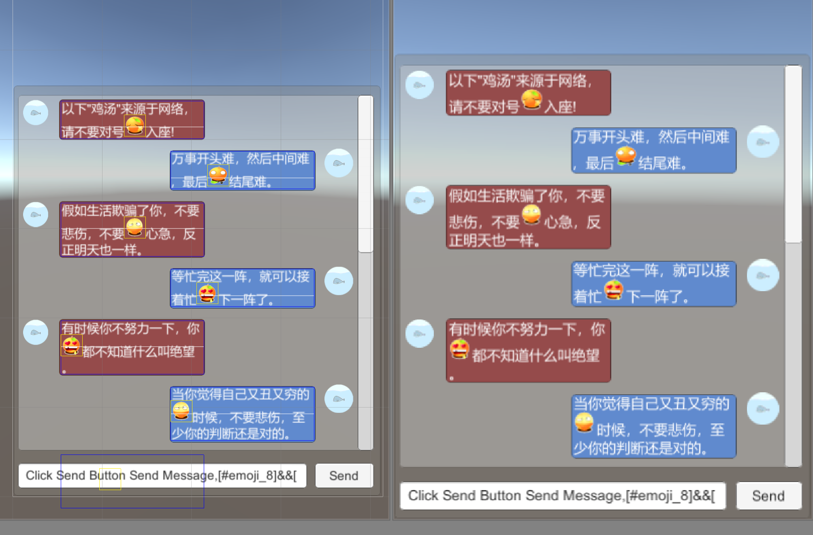

### **新增功能**  
0. 重写了配置文件编辑工具，可快速生成表情配置文件
1. 使用shader渲染表情动画，取消了在update中循环更新模型数据  
2. 支持在编辑器中直接预览(支持不完全)  
3. 在编辑中增加了线框辅助调试  
4. 利用了对象池对部分比较明显的GC问题进行了优化  
5. 重新更换了坐标系转换的计算，更好的支持Canvas Render Mode的切换  
6. 精简整理了代码  
7. 简单优化了编辑器的操作  

---

### **强行解释**  
0. 性能优化会在后面持续进行
1. 利用shader渲染表情动画，可以更好的利用设备的性能。一开始是准备利用UGUI的Mesh支持uv0-uv3，存下多个数据，来做表情动画。在使用了uv移动来做动画后，感觉uv0-uv3四层不够用，于是坚持老方法。   
2. 在选择使用uv移动来做动画，对表情图集有一定的要求:建议每个表情的规格一致，动态表情需要放成一排。具体参考demo自带图集。  
3. 现在所有的参数都已经在配置文件中， 请根据需求自行调整。  
4. 之前也提过，写这个插件并没有实际的使用机会，难免考虑不周，收集的意见，大部分都有自己的想法，比较杂乱，所以建议如果能直接使用，那是最好的。如果跟自己的需求有偏差，希望能作个参考，自己更改，欢迎提交pr。然后我会再尽力写成通用的。  
5. 提交的pr，改动小，我会检查合并，如果改动太大，我会单独新建分支留存，以便有需要的人查看。  

---  

### **功能介绍**  
1. 此插件是基于UGUI所做的图文混排功能，常用于聊天系统的表情嵌入;  
2. 可支持静/动态表情,支持超链接;  
3. 实现原理，是基于UGUI的富文本，使用quad标签进行占位;  
4. 使用了Asset文件来存储本地的表情信息;  
5. Text根据正则表达式，解析文本，读取相应的表情信息，并在相应位置绘制相应的Sprite;  
6. 正则表达式为[图集ID#表情标签]，图集ID为-ID时，表示此标签为超链接，如-1,图集ID为 0时，可省略不写;  
7. 有同学提过想支持移动端系统自带的表情，我这里只提一个简单的实现思路，集成不看自己的实际需求了，自己备好系统表情的图集，再解析一下当前系统输入表情的正则表达式，然后跟插件一样的嵌入到Text中（这算是正常的集成实现思路么？）;  
---
### **使用步骤**  
1. 选择一张表情图片，导入在unity里，为了支持透明通道，记得在图片属性中勾选`Alpha Is Transparent` 
2. 右键选择图片，点击`Create/Sprite Asset`,打开资源窗口编辑器,点击`Save`来保存配置文件
     
3. 在保存配置文件后，首先为图集设置一个唯一Id,然后设置图集表情的行列数，来自动切分表情，动态表情会自动将一排的Sprite自动归纳为一个表情，最后为每个表情设置一个可读的Tag，后续提供给Text调用。
     
4. 配置文件创建完成后，在编辑器中，也可以预览，操作与资源窗口编辑器类型，并且点击`Open Asset Window`也可以打开编辑器窗口
     
5. 文字使用方式，参考demo场景'Text'，输入`NewText[1#rock]`即可显示表情

---  

### **截图展示**  
  
  
   
